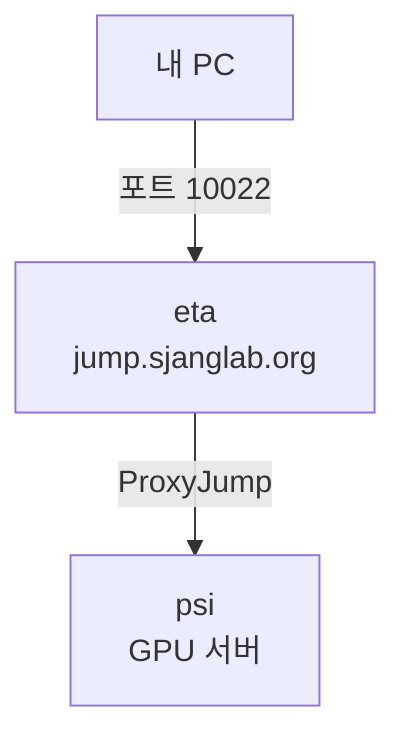

# EvolvePro Workshop

AI 기반 단백질 진화 최적화

<div class="abs-br m-6 text-sm opacity-50">
SBEE Lab · 2026
</div>

---
layout: center
class: text-left
---

# 목차

<Toc :columns="2" :maxDepth="1" />

---

# EvolvePro란?

<div class="grid grid-cols-2 gap-8">
<div>

- 단백질 서열 → **PLM 임베딩** 추출
- Random Forest로 활성 예측
- **라운드당 10개** 데이터로 반복 학습
- 다목적 최적화 가능

<br>

**기존**: 수천 개 변이체 스크리닝

**EvolvePro**: 수십 개로 최적 변이체 도달

</div>
<div>


<p class="text-xs text-center opacity-60 mt-1">Jiang et al., Science (2024)</p>

</div>
</div>

---

# 워크플로우 개요

4단계로 구성


<div class="grid grid-cols-4 gap-4 mt-6 text-xs">

<div class="border rounded p-2">

**Process**

FASTA/CSV로 정리

</div>
<div class="border rounded p-2">

**PLM**

임베딩 벡터 추출 (GPU)

</div>
<div class="border rounded p-2">

**EVOLVEpro**

활성 예측 → 변이체 선택

</div>
<div class="border rounded p-2">

**Plot**

결과 시각화

</div>

</div>

---

# 오늘의 순서

<div class="grid grid-cols-2 gap-8">
<div>

### 환경 준비

1. (Windows) WSL2 설치
2. SSH 키 생성 & 등록
3. SSH 접속 설정
4. 서버 접속 & 환경 확인

</div>
<div>

### EvolvePro 실습

5. EvolvePro 설치
6. 데이터 준비
7. PLM 임베딩 추출
8. EVOLVEpro 실행
9. 결과 시각화

</div>
</div>

---
layout: section
hideInToc: true
---

# Part 1: 환경 준비

Windows 사용자를 위한 WSL2 설치부터

---

# Windows: WSL2 설치

> macOS/Linux 사용자는 이 단계를 건너뛰세요

### 1. PowerShell (관리자) 에서 실행

```powershell
wsl --install
```

완료 후 **PC 재부팅**

### 2. Ubuntu 초기 설정

시작 메뉴 → "Ubuntu" 실행

```
Enter new UNIX username: (사용자명 입력)
New password: (비밀번호 — 화면에 표시 안 됨)
```

---

# 터미널 기본 명령어

앞으로 계속 사용할 필수 명령어

| 명령어 | 설명 | 예시 |
|--------|------|------|
| `ls` | 파일 목록 | `ls` |
| `cd` | 디렉토리 이동 | `cd Documents` / `cd ..` / `cd ~` |
| `pwd` | 현재 위치 확인 | `pwd` |
| `mkdir` | 디렉토리 생성 | `mkdir my_project` |
| `cat` | 파일 내용 보기 | `cat README.md` |
| `cp` | 파일 복사 | `cp file1.txt file2.txt` |

> **팁**: ↑ 이전 명령어 불러오기 / Tab 파일명 자동완성

---
layout: section
hideInToc: true
---

# Part 2: SSH 접속 설정

서버에 접속하기 위한 열쇠 만들기

---

# SSH란?

원격 서버에 안전하게 접속하는 방법

<div class="grid grid-cols-2 gap-8">
<div>

### SSH 키 = 디지털 열쇠

- **개인키** (`id_ed25519`) — 내 컴퓨터에만 보관
- **공개키** (`id_ed25519.pub`) — 서버에 등록

비밀번호 없이 자동 인증됩니다

</div>
<div>

### 접속 경로



</div>
</div>

---

# SSH 키 생성

### 1. 키 생성 (모든 질문에 Enter)

```bash
ssh-keygen -t ed25519
```

### 2. 공개키 확인

```bash
cat ~/.ssh/id_ed25519.pub
```

출력 예: `ssh-ed25519 AAAAC3NzaC1lZDI1NTE5AAAA... user@hostname`

### 3. 관리자에게 전달

| 항목 | 예시 |
|------|------|
| 이름 / 사용자명 | 홍길동 / `gildong` |
| SSH 공개키 | 위 출력 전체 |
| 접근 호스트 | `psi` |

---

# SSH 설정 파일 작성

`ssh psi` 한 줄로 접속할 수 있게 설정합니다

```bash
mkdir -p ~/.ssh/sockets
```

`~/.ssh/config` 파일을 생성하고 아래 내용을 붙여넣으세요:

``` {2|9-10|12-14}{maxHeight:'280px'}
Host eta psi rho tau
    User 본인사용자명
    Port 10022
    IdentityFile ~/.ssh/id_ed25519
    ControlMaster auto
    ControlPath ~/.ssh/sockets/%r@%h-%p
    ControlPersist 600

Host eta
    HostName jump.sjanglab.org

Host psi
    HostName 10.100.0.2
    ProxyJump eta
```

⚠️ **`본인사용자명`** 을 관리자에게 받은 사용자명으로 변경하세요

---

# SSH 접속 테스트

```bash
ssh psi
```

처음 접속 시 `yes` 입력:

```
Are you sure you want to continue connecting? yes
```

접속 성공:

```
[gildong@psi:~]$
```

<div class="text-sm mt-4">

| 안 될 때 | 해결 |
|----------|------|
| `Connection refused` | 계정 미생성 → 관리자 확인 |
| `Permission denied` | 키 불일치 → 공개키 재전달 |
| `Connection timed out` | 인터넷 확인 |

</div>

---
layout: section
hideInToc: true
---

# Part 3: 서버 환경 확인

GPU, 작업 디렉토리, Python 환경

---

# 서버 환경 확인

### GPU 확인

```bash
nvidia-smi
```

GPU 이름, 메모리, 사용률이 표시됩니다.

### 작업 디렉토리

```bash
ls /workspace/$USER/
```

모든 작업은 `/workspace/본인사용자명/`에서 진행합니다.

```bash
cd /workspace/$USER/
```

### conda 확인

```bash
conda --version
```

> `/workspace/$USER/`는 고속 SSD입니다.
> 홈 디렉토리(`~`)가 아닌 여기서 작업하세요.

---
layout: section
hideInToc: true
---

# Part 4: EvolvePro 설치

---

# EvolvePro 설치

### 1. 코드 다운로드

```bash
cd /workspace/$USER/
git clone https://github.com/mat10d/EvolvePro.git
cd EvolvePro
```

### 2. EVOLVEpro 환경 생성

```bash
conda env create -f environment.yml
conda activate evolvepro
```

### 3. PLM 환경 생성 (임베딩 추출용)

```bash
sh setup_plm.sh
conda activate plm
```

> 두 환경을 분리하는 이유: PyTorch 등 딥러닝 라이브러리와
> EVOLVEpro 코어 라이브러리의 의존성 충돌을 방지

---

# 설치 확인

```bash
conda activate evolvepro
python -c "import evolvepro; print('evolvepro OK')"
```

```bash
conda activate plm
python -c "import torch; print(f'CUDA: {torch.cuda.is_available()}')"
python -c "import esm; print('ESM OK')"
```

예상 출력: `evolvepro OK` / `CUDA: True` / `ESM OK`

> `CUDA: False` → GPU 드라이버 문제, 관리자 문의

---
layout: section
hideInToc: true
---

# Part 5: 실습

데이터 준비 → PLM 임베딩 → EVOLVEpro 실행 → 시각화

---

# 데이터 준비

<div class="grid grid-cols-2 gap-8">
<div>

**FASTA** — 변이체 서열

```
>WT
MSKGEELFTG...
>A1V
VSKGEELFTG...
```

</div>
<div>

**CSV** — 활성 데이터

```csv
variant,activity
WT,1.0
A1V,0.85
```

</div>
</div>

### 예제 데이터 확인

```bash
cd /workspace/$USER/EvolvePro && ls data/dms/
```

---

# PLM 임베딩 추출

ESM-2 모델로 각 변이체의 임베딩 벡터를 생성합니다

```bash
conda activate plm

python evolvepro/plm/esm/extract.py \
  esm2_t48_15B_UR50D \
  data/dms/brenan/brenan.fasta \
  output/plm/esm/brenan \
  --toks_per_batch 512 \
  --include mean \
  --concatenate_dir output/plm/esm/
```

<div class="text-sm mt-4">

| 파라미터 | 설명 |
|----------|------|
| `esm2_t48_15B_UR50D` | ESM-2 15B 모델 |
| `--toks_per_batch 512` | GPU 메모리에 맞게 조절 (부족 시 256) |
| `--include mean` | 평균 풀링 임베딩 사용 |

</div>

> 첫 실행 시 모델 다운로드에 시간이 걸립니다

---

# EVOLVEpro 실행

<div class="text-sm">

```bash
conda activate evolvepro && cd /workspace/$USER/EvolvePro

python scripts/dms/dms_main.py \
  --dataset_name brenan \
  --experiment_name workshop_test \
  --model_name esm2_t48_15B_UR50D \
  --embeddings_path output/plm/esm/brenan.csv \
  --labels_path data/dms/brenan/brenan.csv \
  --num_simulations 3 --num_iterations 5 \
  --measured_var activity --learning_strategies topn \
  --num_mutants_per_round 10 --num_final_round_mutants 50 \
  --regression_types randomforest \
  --output_dir output/dms/workshop_test
```

</div>

| 파라미터 | 의미 |
|----------|------|
| `--num_iterations 5` | Active learning 라운드 수 |
| `--num_mutants_per_round 10` | 라운드당 선택 변이체 수 |
| `--learning_strategies topn` | 예측 상위 N개 선택 |
| `--regression_types randomforest` | 회귀 모델 종류 |

---

# 학습 전략 옵션

어떤 변이체를 다음 라운드에 선택할 것인가?

| 전략 | 설명 | 특성 |
|------|------|------|
| `random` | 무작위 선택 | 기준선 비교용 |
| `topn` | 예측 상위 N개 | 활용(exploitation) 중심 |
| `topn2bottomn2` | 상위/하위 각 N/2 | 탐색+활용 균형 |
| `dist` | 다양성 기반 | 탐색(exploration) 중심 |

---

# 결과 시각화

### 결과 확인

```bash
ls output/dms/workshop_test/
```

### 시각화 실행

```bash
python scripts/plot.py \
  --input_dir output/dms/workshop_test \
  --output_dir output/plots/workshop_test
```

### 결과 파일을 로컬로 복사 (내 컴퓨터에서)

```bash
scp -r psi:/workspace/$USER/EvolvePro/output/plots/workshop_test ./
```

> `scp`는 SSH를 이용한 파일 복사 명령어입니다.
> SSH 설정을 했으므로 `psi:`만으로 접속됩니다.

---

# 트러블슈팅: SSH

<div class="text-sm">

| 증상 | 해결 |
|------|------|
| `Connection refused` | 계정 미생성 → 관리자 확인 |
| `Permission denied (publickey)` | 공개키 불일치 → 재전달 |
| `Connection timed out` | 인터넷 확인, `ssh eta`로 단계별 테스트 |

</div>

### 트러블슈팅: Python / GPU

<div class="text-sm">

| 증상 | 해결 |
|------|------|
| `conda: command not found` | `source /opt/conda/etc/profile.d/conda.sh` |
| `ModuleNotFoundError` | `conda activate evolvepro` 또는 `plm` 확인 |
| `CUDA out of memory` | `--toks_per_batch` 줄이기 (512→256→128) |
| `CUDA: False` | `nvidia-smi` 확인, 관리자 문의 |

</div>

---
layout: end
---

# 마무리

<div class="grid grid-cols-3 gap-8 mt-8 text-sm">
<div class="border rounded p-4">

**Colab 튜토리얼**

설치 없이 브라우저에서 실습

[Google Colab 열기](https://colab.research.google.com/drive/1YCWvR73ItSsJn3P89yk_GY1g5GEJUlgy)

</div>
<div class="border rounded p-4">

**논문**

Jiang et al., *Science* (2024)

"Rapid in silico directed evolution by a protein language model with EVOLVEpro"

</div>
<div class="border rounded p-4">

**GitHub**

[mat10d/EvolvePro](https://github.com/mat10d/EvolvePro)

이슈/버그 리포트 환영

</div>
</div>
